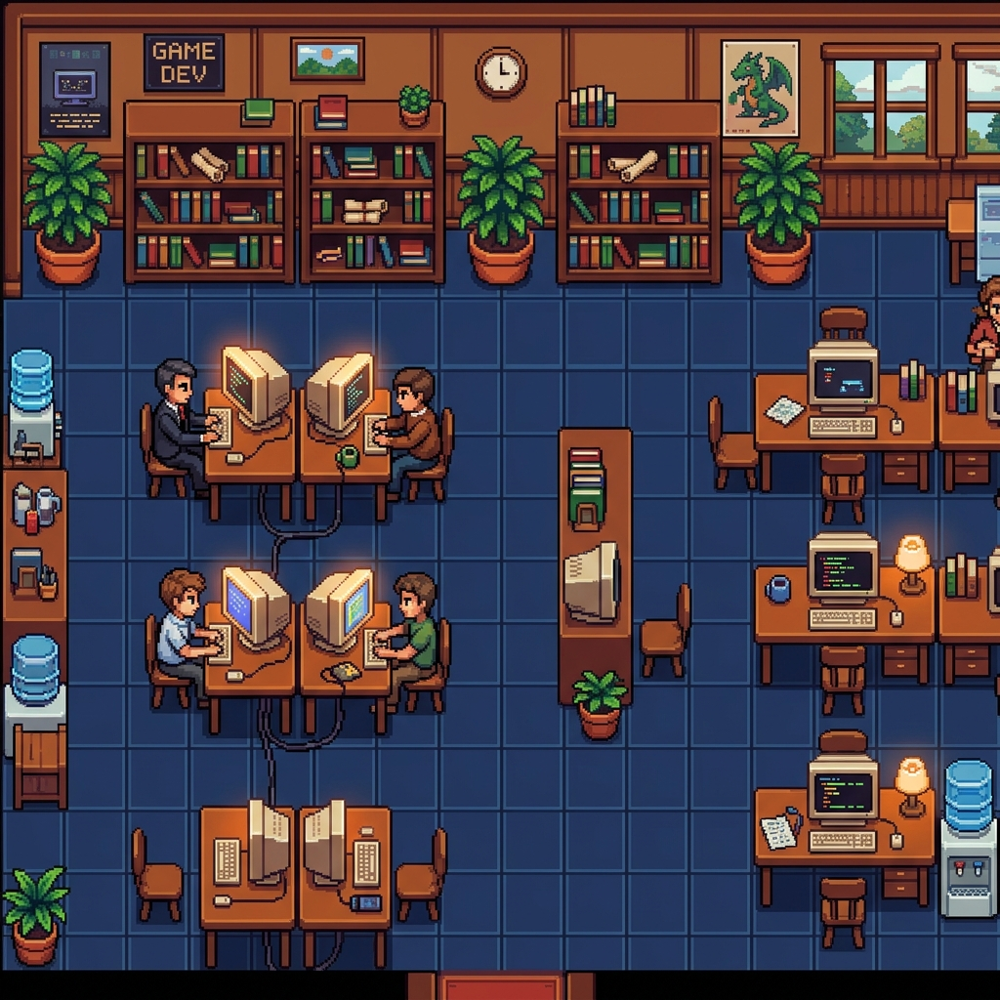

# 🏢 Pixel Agent Office — AI Agent Management System



Welcome to the **Pixel Agent Office**, a fully functional 8-bit retro-RPG style AI agent management workspace. This system models a virtual office where each desk and character represents an autonomous AI agent powered locally by **Ollama**. Users can create, edit, chat with, compact memories of, and chain agents together into collaborative execution pipelines.

---

## 📸 visual showcase & Aesthetic Design
* **HTML5 Canvas Office**: A top-down 2D tile map of a retro office. Features floor tile textures, wall windows displaying day/night cycles, plants, bookshelves, a fully functional system-synced ticking wall clock, and dripping water coolers.
* **Animated Agent Sprites**: Agents bob up and down simulating breathing when idle. When thinking (making requests to Ollama), they display custom typing hands and bubble dots. Sprites are custom-styled with roles (e.g. glasses for researchers, terminal icons for coder reviews) and color-coded.
* **Scanline CRT FX Overlay**: A retro CRT monitor filter overlay with subtle scanlines, giving the canvas the feel of an old-school arcade cabinet or terminal screen.
* **Tactile Buttons**: Buttons shift downward when clicked to simulate physical 8-bit button presses.
* **Day & Night Shifts**: Swapping theme lighting shifts between a warm wood/beige day shift palette and a neon cyberpunk/navy night shift palette.

---

## 🛠 Tech Stack
1. **Frontend**: Pure Vanilla HTML5, CSS variables, and JavaScript (single-file: `index.html`). No build tools, no frameworks, no npm packages.
2. **Backend**: Python standard library (`http.server`, `urllib.request`, `zipfile`, `json`). Serves static assets, handles REST API operations, packages agent backups, and proxies local Ollama connections (single-file: `server.py`).
3. **Local LLM Server**: Assumes a local **Ollama** server running (defaulting to `http://localhost:11434`).
4. **Typography**: Google Fonts CDN: `Press Start 2P`.

---

## 🚀 Key Features

### 1. Agent Management (Hire & Fire)
* **Creation Form**: Captured properties include Name, Role, Model, Shirt Color, Compaction threshold, and Chaining route target.
* **Live Sprite Builder Preview**: Instantly updates a 2X-scaled pixel sprite inside the modal as you select different shirt colors or role behaviors.
* **Offline Fallback**: Automatically fetches local models list from Ollama. If Ollama is offline, mock models (e.g. `llama3:8b`, `mistral:latest`, `phi3:latest`) are offered to ensure usability.

### 2. Context Auto-Compaction
* Helps prevent context window overflow when conversations grow large.
* **Compaction Routine**:
  1. Once the message threshold (default: 20 messages) is reached, the system extracts all messages except the last 4.
  2. The historical logs are compiled and sent to Ollama with a request to generate a complete summary.
  3. The old logs are replaced with a single `system` message: `{"role": "system", "content": "Previous conversation summary: <summary>"}`.
  4. The last 4 messages remain intact in active conversation memory.
* **Compaction Triggers**:
  * **Threshold reached** (automated check after every message).
  * **Manual Compaction** (triggered via the 🗜 button in the chat panel).
  * **Session End** (triggered via settings, running bulk summaries for all active agents before exiting).

### 3. Agent Output Chaining
* Allows routing output from one agent to another to construct collaborative pipelines (e.g. **Researcher &rarr; Data Analyst &rarr; Thai Academic Writer**).
* **Manual Chain (`&rarr; CHAIN` button)**: Copies the last assistant response, closes the chat, opens the target agent, and pre-fills their input box (allowing you to edit before sending).
* **Auto-Chain Mode**: If toggled globally in settings, when Agent A finishes generating a response, the output is automatically routed to Agent B (opening their chat and sending the query autonomously).

---

## 📁 File Structure
```
AMS/
├── index.html      ← Frontend (Canvas, Styles, Forms, Chat, Client logic)
├── server.py       ← Stdlib Python Server (File CRUD, Proxy requests, Zip exporter)
├── README.md       ← Project documentation
└── agents/         ← Generated data folder (individual JSON files per agent)
    ├── <uuid-1>.json
    └── ...
```

---

## ⚙️ Running Locally

### Prerequisites
* **Python 3.x** installed.
* **Ollama** installed and running locally:
  ```bash
  # Check if Ollama is running
  curl http://localhost:11434
  ```

### Startup Instructions
1. Run the Python backend server:
   ```bash
   python3 server.py
   ```
   *The server starts on port `8080`.*
2. Open your web browser and navigate to:
   ```
   http://localhost:8080
   ```

---

## 📄 API Endpoints Reference
The Python backend supports:
* `GET  /` &rarr; Serves `index.html`.
* `GET  /agents` &rarr; Lists all agent configurations.
* `GET  /agents/<id>` &rarr; Reads a specific agent JSON.
* `POST /agents` &rarr; Creates a new agent configuration.
* `PUT  /agents/<id>` &rarr; Updates an existing agent configuration.
* `DELETE /agents/<id>` &rarr; Deletes an agent JSON and fires them from the office.
* `GET  /agents/export` &rarr; Zips all `./agents/*.json` configuration files in-memory and downloads as `agents_backup.zip`.
* `GET  /ollama/models?url=<url>` &rarr; Proxies `GET <url>/api/tags` to check model tags. Fallbacks are delivered if the connection is refused.

---

## 💡 System Prompts (Preset Behaviors)
* **Deep Researcher**: Focuses on thorough, multi-angle research, citing evidence, and synthesizing findings.
* **Code Reviewer**: Focuses on bugs, security, performance, code styling, and explaining improvements.
* **Data Analyst**: Interprets data, identifies trends, suggests charts, and ensures statistical precision.
* **Thai Academic Writer**: Writes formal, academically rigorous Thai prose compliant with Scopus/ISI standards.
* **General Assistant**: General helper adapting tone dynamically.
